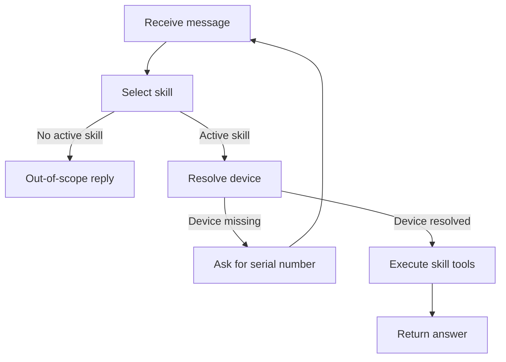
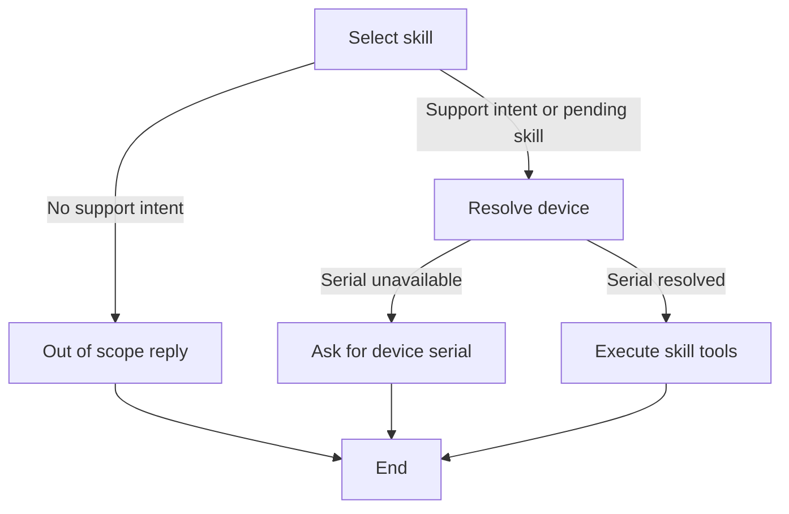

# Python AI MCP Agent

A FastAPI device-support chat application. A supervisor routes actionable requests into predefined skills, retains browser-session context, calls the permitted Model Context Protocol (MCP) tools, and uses the OpenAI Responses API to generate answers.

## Architecture

```text
Browser chat message
       |
       v
FastAPI application
       - load browser session
                      |
                      v
Supervisor
       - select a skill only for a clear support intent
       - retain pending workflow and device serial context
  - expose only allowed MCP tools
       |
       v
MCP client (stdio)
       |
       v
MCP server
       - resolve_device_reference
  - get_device
  - get_device_metrics
  - check_provisioning_status
```

The backend owns the skill registry. A skill supplies instructions and a tool allowlist, so the model operates inside the selected workflow boundary.

## Supervisor Graph

The supervisor is represented as graph nodes and conditional edges in `ai_backend.py`. It makes the workflow explicit while keeping the implementation lightweight.



An active skill can be a newly selected intent or a pending workflow from an earlier message. That edge lets a serial-only reply such as `halalfood` complete an earlier performance request.

## Predefined Skills

| Skill | Selected for | Permitted tools |
| --- | --- | --- |
| `historical_reply` | Requests for past metrics or performance history | `get_device`, `get_device_metrics` |
| `check_provisioning_status` | Viewing or inspecting if a device is provisioned/online | `get_device`, `check_provisioning_status` |
| `execute_provisioning` | Command to provision, re-activate, or configure a device | `get_device`, `check_provisioning_status`, `validate_activation`, `execute_provisioning`, `verify_provisioning` |
| `diagnostic` | Troubleshooting slow performance, errors, or issues | `get_device`, `get_device_metrics` |

Greetings and unclear messages, such as `Hi`, do not select a skill or expose MCP tools.

## Conversation Memory

Each browser receives an independent session cookie. The server keeps the session's OpenAI response ID, last resolved device serial, and any unfinished workflow.

For example, the supervisor remembers that the second message completes the first request:

```text
You: Check the performance.
AI: Please provide the device serial number.

You: halalfood
AI: [retrieves and summarizes halalfood performance metrics]
```

When a user supplies a serial-only reply, the supervisor reuses the pending skill, resolves the serial through the device inventory, and completes the requested operation. A new explicit request replaces the pending workflow.

## LangGraph Workflow

The FastAPI application runs each message through an executable LangGraph state graph in [workflow.py](workflow.py):



The `execute_skill` node filters MCP tools against the selected skill's allowlist before calling the model.

## Prerequisites

- Python 3.12 or later
- An OpenAI API key

## Setup

Create and activate a virtual environment in PowerShell:

```powershell
python -m venv venv
.\venv\Scripts\Activate.ps1
```

Install the dependencies:

```powershell
pip install -r requirements.txt
```

Create a `.env` file in the project root:

```env
OPENAI_API_KEY=your_openai_api_key
```

## Terminal Chat

With the virtual environment active:

```powershell
python .\ai_backend.py
```

The program starts `mcp_server.py` automatically using the same Python interpreter and starts an interactive terminal chat:

```text
You: Why is device ABC123 performing slowly?
```

## Browser Chat

Start the FastAPI application:

```powershell
uvicorn web_app:app --reload
```

Open http://127.0.0.1:8000 in a browser. Each browser receives a separate session cookie, so one user's conversation state cannot conflict with another user's session.

## Sample Questions

```text
Show me the historical metrics for device ABC123 for the last 3 days.
```

```text
Is device ABC123 provisioned?
```

```text
Why is device ABC123 performing slowly?
```

```text
Check the performance.
```

```text
halalfood
```

## MCP Tools

The MCP server currently returns mock device data:

| Tool | Inputs | Result |
| --- | --- | --- |
| `resolve_device_reference` | `user_request` | Finds a registered serial number mentioned in the request |
| `get_device` | `serial_number` | Device model and current status |
| `get_device_metrics` | `serial_number`, `days` | Historical latency metrics |
| `check_provisioning_status` | `serial_number` | Provisioning status |

## Logging

The application logs the full workflow to the terminal: MCP server startup, device resolution, selected skill, permitted tools, model response rounds, tool arguments and results, and request durations.

The default log level is `INFO`. Enable additional library diagnostics for the current PowerShell session with:

```powershell
$env:LOG_LEVEL="DEBUG"
uvicorn web_app:app --reload
```

## Notes

- This project uses MCP 2.x and imports `MCPServer` from `mcp.server`.
- `mcp_server.py` communicates over stdio; do not add ordinary `print()` calls to that server because stdout is reserved for the MCP protocol.
- Chat sessions are held in the FastAPI process memory. They reset when the server restarts; use Redis or a database for persistent production sessions.